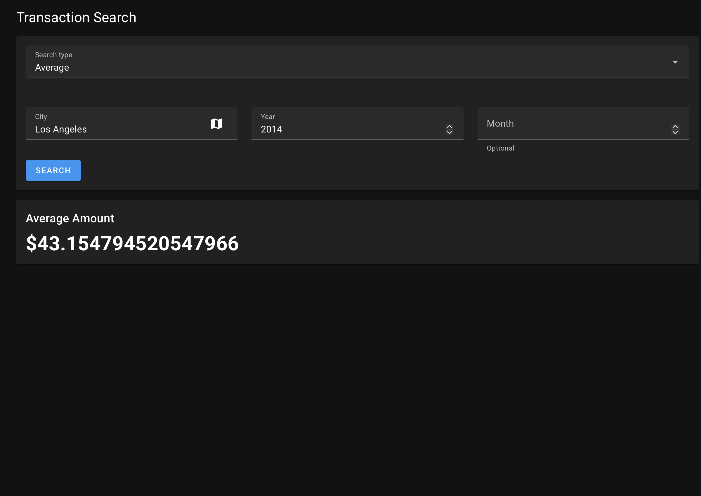
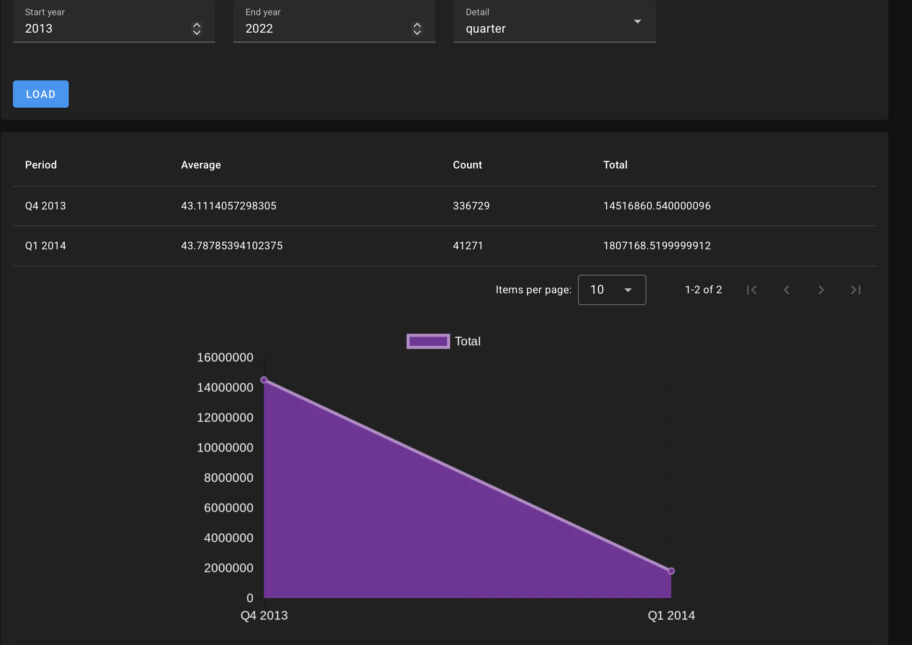
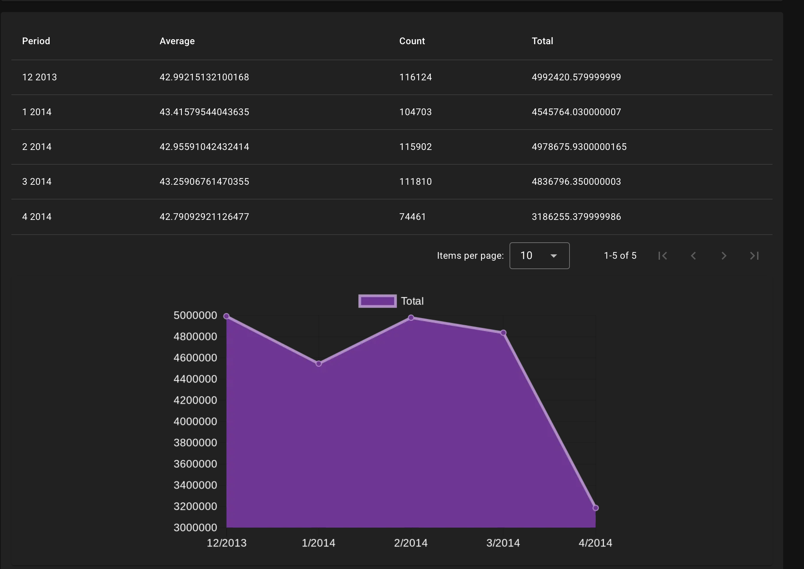
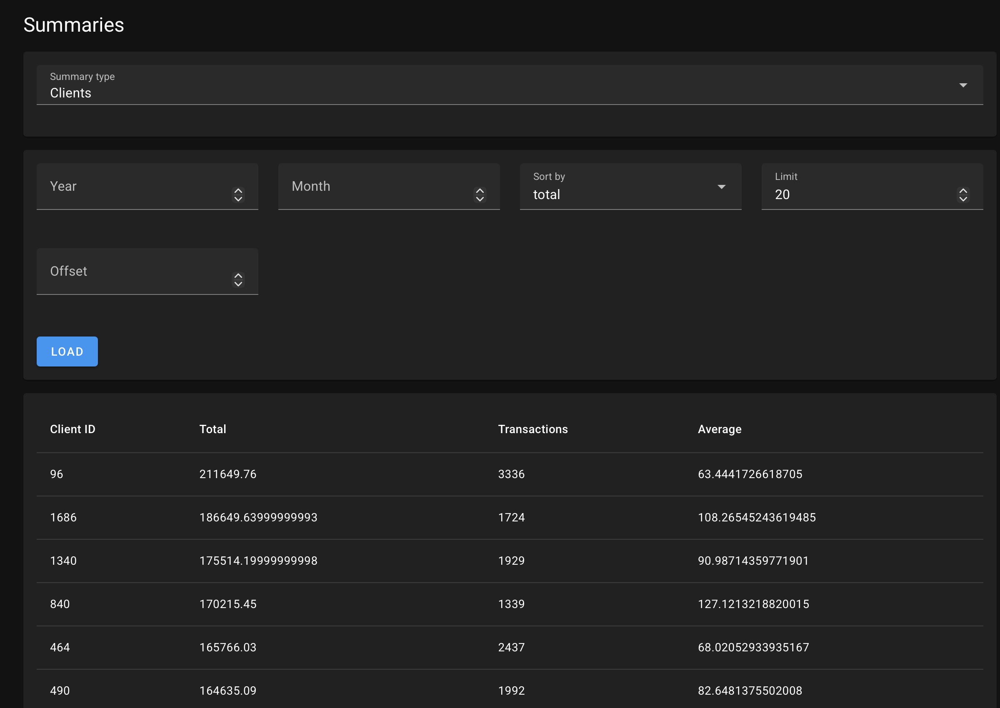

# TIQ — Transaction Analytics Platform

A full-stack RESTful web application for managing and analyzing financial transaction data. Built with a Vue.js + Vuetify frontend, a Spring Boot backend, and PostgreSQL — all containerized with Docker.

---

## Screenshots

<table>
  <tr>
    <td></td>
    <td></td>
  </tr>
  <tr>
    <td></td>
    <td></td>
  </tr>
</table>

## Tech Stack

| Layer | Technology | Reason |
|:---|:---|:---|
| **Frontend** | Vue.js + Vuetify | Lightweight SPA with robust UI components |
| **Backend** | Java + Spring Boot | Type safety, security, and rapid REST API development |
| **Database** | PostgreSQL | Relational integrity and seamless Docker/Spring integration |
| **Containers** | Docker + Docker Compose | Multi-container orchestration and one-step deployment |

---

## Features

### Core Endpoints

| Endpoint | Description |
|:---|:---|
| `GET /transactions/{id}` | Retrieve a single transaction by ID |
| `GET /transactions` | Retrieve or delete client transaction history with month/year filters |
| `GET /transactions/average` | Average transaction amount (USD) per city/month/year (excluding online) |
| `GET /transactions/total` | Total daily volume per US state and month, paginated (10/20/50/100) |
| `GET /transactions/tb` | Top/Bottom N transaction amounts for a given year or range of years |

### Additional Endpoints

- **`/merchants`** — Full CRUD operations for merchant entities
- **`/summaries`** — Complex reporting endpoint generating summaries derived from merchant and transaction data, with dynamic chart generation via [QuickChart.io](https://quickchart.io)

### Content Negotiation

All endpoints support `application/json` (default) and `text/csv` via the `Accept` header or `acceptParam` query parameter. The `Accept` header takes priority when both are provided.

### Third-Party Integrations

- **[QuickChart.io](https://quickchart.io)** — Dynamic chart generation for summary reports
- **[Nominatim (OSM)](https://nominatim.openstreetmap.org)** — Geocoding and city-based input validation

---

## Architecture

The backend follows a layered architecture: **Controllers → Services → Repositories → Models**, with separate packages for configuration, exceptions, and startup logic.

- **REST Maturity:** Level 2 (HTTP verbs, status codes, resource-based URIs)
- **Frontend pattern:** MVVM via Vue.js component architecture
- **Service layer:** Interface-based, enabling loose coupling and testability
- **Content negotiation:** Centralized via a custom `ContentTypeNegotiator` class
- **Error handling:** Custom `ApiException` + `ApiExceptionHandler` — no boilerplate try/catch in services
- **Environment config:** `.env`-driven for flexible multi-environment deployment

---

## Running Locally with Docker

**Prerequisites:** Docker and Docker Compose installed.

1. Create a `.env` file in the project root:

```env
POSTGRES_DB=<your_db_name>
POSTGRES_USER=<your_user>
POSTGRES_PASSWORD=<your_password>
BACKEND_PORT=8080
FRONTEND_PORT=80
DB_PORT=5432
TRANSACTIONS_DATA_PATH=transactions-data
```

2. The repository includes a sample dataset in `transactions-data/sample.csv` so the app runs out of the box. For the full dataset (2014–2016), see [Data Setup](#data-setup) below.

3. From the repository root, run:

```bash
docker compose up --build
```

4. Access the app at: [http://localhost](http://localhost)

> The backend automatically populates the database on startup if it detects no existing data.

---

## Data Setup

The `transactions-data/` folder inside the repo contains sample CSVs to get started. To run the app with the full dataset, replace them with your full files — the backend expects these exact names:

```
transactions-data/
├── merchants.csv       # Included — trimmed sample for quick setup
└── transactions.csv    # Included — trimmed sample (full data: 2014–2016)
```

Full CSVs are gitignored — only the sample files are tracked. Your data won't be committed.

---

## Project Structure

```
/
├── .github/
│   └── workflows/
│       └── build.yml         # GitHub Actions CI/CD pipeline
├── backend/                  # Spring Boot / Maven application
│   ├── src/
│   │   └── main/java/
│   │       ├── config/       # Spring config (CORS, content negotiation)
│   │       ├── controller/   # HTTP controllers + ContentTypeNegotiator
│   │       ├── service/      # Business logic (interface-based)
│   │       ├── repository/   # Data access layer
│   │       ├── model/        # Entities and DTOs
│   │       ├── exception/    # Custom exceptions and handler
│   │       └── startup/      # Automatic CSV data initialization
│   └── Dockerfile
├── frontend/                 # Vue.js + Vuetify SPA
│   ├── pages/                # Application views
│   ├── components/           # Reusable UI components
│   ├── api/                  # Axios-based API callers
│   ├── router/               # Vue Router configuration
│   └── Dockerfile
├── transactions-data/        # CSV seed data
│   ├── merchants.csv         # Trimmed sample (full file is gitignored)
│   └── transactions.csv      # Trimmed sample (full file is gitignored)
├── docker-compose.yml        # Local build
├── docker-compose.prod.yml   # Server deployment (pulls from GHCR)
└── .env
```

---

## CI/CD with GitHub Actions

The pipeline builds and pushes Docker images to the GitHub Container Registry (GHCR) on every push to `main`.

### Workflow file: `.github/workflows/build.yml`

```yaml
name: Build and Push Docker Images

on:
  push:
    branches:
      - main

jobs:
  build-backend:
    runs-on: ubuntu-latest
    steps:
      - name: Checkout
        uses: actions/checkout@v4

      - name: Log in to GHCR
        uses: docker/login-action@v3
        with:
          registry: ghcr.io
          username: ${{ github.actor }}
          password: ${{ secrets.GITHUB_TOKEN }}

      - name: Build and push backend
        uses: docker/build-push-action@v5
        with:
          context: ./backend
          push: true
          tags: ghcr.io/${{ github.repository }}/backend:latest

  build-frontend:
    runs-on: ubuntu-latest
    steps:
      - name: Checkout
        uses: actions/checkout@v4

      - name: Log in to GHCR
        uses: docker/login-action@v3
        with:
          registry: ghcr.io
          username: ${{ github.actor }}
          password: ${{ secrets.GITHUB_TOKEN }}

      - name: Build and push frontend
        uses: docker/build-push-action@v5
        with:
          context: ./frontend
          push: true
          tags: ghcr.io/${{ github.repository }}/frontend:latest
```

> `GITHUB_TOKEN` is provided automatically by GitHub — no manual secret setup needed for GHCR.

### Deploying on a server

Once images are pushed to GHCR, pull and run them on any server with Docker installed using the prod compose file:

```bash
docker compose -f docker-compose.prod.yml pull
docker compose -f docker-compose.prod.yml up -d
```

> Add `GITHUB_REPOSITORY=your-username/your-repo` to your server's `.env` file so the image URLs resolve correctly. GHCR packages are private by default — make them public via GitHub → Packages, or run `docker login ghcr.io` on the server first.

---

## API Documentation

Full OpenAPI documentation is available at `/swagger-ui.html` when the backend is running. It describes all endpoints, parameters, and response types.

---

## Contributors

| Contributor | Responsibilities |
|:---|:---|
| **Miguel Akira López Asano** | Backend endpoints (average, total, top/bottom, merchants, summaries), frontend pages & components, Docker setup, CI/CD pipeline, WarpGate deployment, project report |
| **Efa Rhys** | Backend CRUD for transactions, city map integration (Nominatim), OpenAPI documentation |

---

## Notes

> **Repository migration:** This project was originally developed on GitLab with a CI/CD pipeline pushing to the GitLab Container Registry. It has since been migrated to GitHub — the pipeline has been rewritten for GitHub Actions and GHCR as documented above.

---

## References

- [Spring Boot Docs](https://docs.spring.io/spring-boot/index.html) · [Vue.js Docs](https://vuejs.org/guide/introduction.html) · [Vuetify Docs](https://vuetifyjs.com) · [PostgreSQL Docs](https://www.postgresql.org/docs/) · [QuickChart.io Docs](https://quickchart.io/documentation/) · [Baeldung — OpenAPI](https://www.baeldung.com/spring-rest-openapi-documentation) · [MDN HTTP Status Codes](https://developer.mozilla.org/en-US/docs/Web/HTTP/Reference/Status)